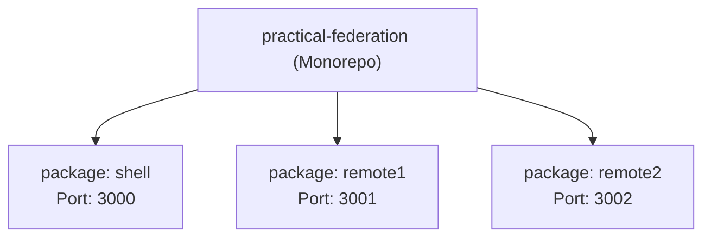
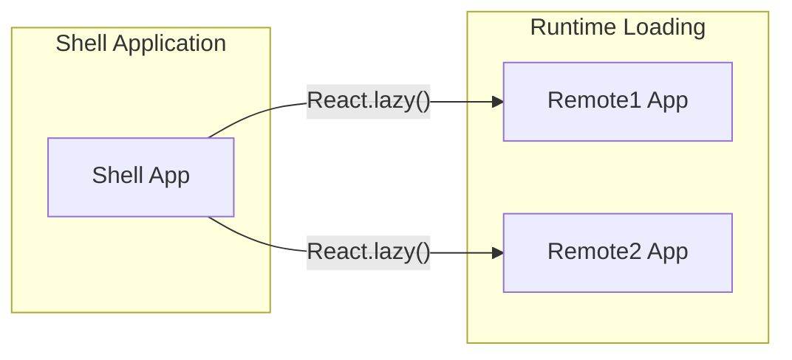
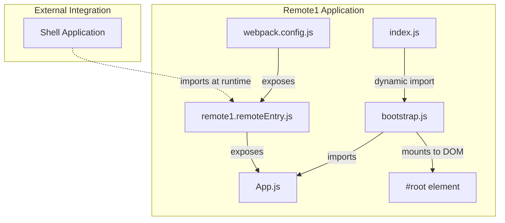

### Introduction

This is a reference implementation of a microfrontend architecture using Webpack Module Federation with React. It demonstrates how to build independent frontend applications that can be developed, deployed, and versioned separately, while being composed into a cohesive user experience at runtime.

### Monorepo Package Structure

The repository is structured as a Lerna-managed monorepo containing three packages:



- **Shell:** The container application that orchestrates and renders the remote applications
- **Remote1:** A standalone application that exposes components to be consumed by the Shell
- **Remote2:** Another standalone application that exposes components to be consumed by the Shell

Each application can be developed and run independently, while the Shell application combines them at runtime.

### Microfrontend Architecture

The implementation follows a host-remote pattern where the shell application serves as the container that dynamically loads and renders applications from remote sources.



#### Shell Application

The shell application's webpack configuration specifies remote applications that it will consume, while each remote application exposes its components.

```js
remotes: {
    remote1: 'remote1@http://localhost:3001/remote1.remoteEntry.js',
    remote2: 'remote2@http://localhost:3002/remote2.remoteEntry.js',
}
```

The shell then uses React's lazy loading mechanism to dynamically import and render the remote components.

#### Remote Application

The remote applications are microfrontends. Each package serves as a standalone React application that can be independently developed and deployed, while also being designed to be consumed by the Shell Application at runtime using Webpack's Module Federation.



The `exposes` property in both remote applications is configured to expose their App component.

```js
exposes: {
  './App': './src/App',
}
```

This allows the Shell application to import the remote App components.
